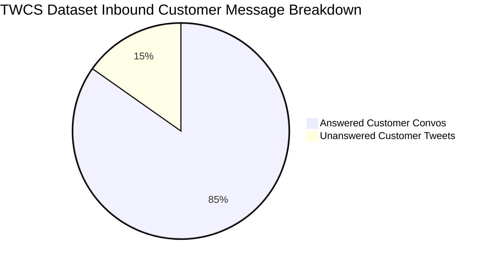

# DATASET PROFILING REPORT — Customer Support on Twitter (TWCS)

> **Phase 1 Output**: Data Ingestion, Schema Verification, Semantic Analysis, and Conversation Reconstruction Pipeline.  
> **Dataset File**: `twcs.csv` (`archive/twcs/twcs.csv` / `twcs(1).csv`)  
> **Status**: Verified Reproducible Pipeline Completed.

---

## 1. Dataset Overview

The dataset consists of customer support interactions between Twitter users and brand customer support handles across 108 distinct companies.

| Metric | Empirical Value |
| :--- | :--- |
| **File Name** | `twcs.csv` (`archive/twcs/twcs.csv`) |
| **File Size** | **521.96 MB** (547,314,642 bytes) |
| **Total Rows / Tweets** | **2,811,774** |
| **Total Columns** | **7** |
| **Total Unique Authors** | **702,777** |
| **Unique Customer Accounts** | **691,959** |
| **Unique Brand Support Handles** | **108** |
| **Inbound Tweets (Customer → Brand)** | **1,537,843** (54.69%) |
| **Outbound Tweets (Brand → Customer)** | **1,273,931** (45.31%) |
| **Duplicate Tweet IDs** | **0** (100% unique primary keys) |

---

## 2. Verified Schema & Data Types

The raw CSV schema was programmatically inspected using chunked stream processing (`src/data/inspect_dataset.py`).

| Column Name | Inferred Type | Non-Null Count | Null Count | Null % | Description & Formatting Notes |
| :--- | :--- | :--- | :--- | :--- | :--- |
| `tweet_id` | `String` / `Int64` | 2,811,774 | 0 | 0.00% | Unique numeric ID for each tweet. Primary key. |
| `author_id` | `String` | 2,811,774 | 0 | 0.00% | Anonymized user ID (e.g. `115712`) OR brand handle (e.g. `AmazonHelp`). |
| `inbound` | `Boolean` | 2,811,774 | 0 | 0.00% | `True` = Customer to Brand; `False` = Brand to Customer. |
| `created_at` | `String` (Datetime) | 2,811,774 | 0 | 0.00% | Timestamp string formatted as `Wed Oct 11 11:53:00 +0000 2017`. |
| `text` | `String` | 2,811,774 | 0 | 0.00% | Tweet body text. Contains `@mentions` and anonymized tokens (`__email__`, `__url__`). |
| `response_tweet_id` | `String` | 994,992 | 1,816,782 | 64.61% | Comma-separated tweet ID(s) posted in response to this tweet (e.g. `115713,115714`). |
| `in_response_to_tweet_id` | `String` | 2,017,439 | 794,335 | 28.25% | Tweet ID that this tweet was replying to. Null for conversation root tweets. |

---

## 3. Inbound vs. Outbound Semantics Validation

We empirically verified the behavior of the `inbound` field using real conversation samples from the dataset rather than making assumptions.

```
Example Record 1:
  tweet_id: 1
  author_id: 115712 (Customer)
  inbound: True
  text: "@AppleSupport I have a problem with my iPhone..."

Example Record 2:
  tweet_id: 2
  author_id: AppleSupport (Brand)
  inbound: False
  in_response_to_tweet_id: 1
  text: "@115712 We are here to help! What iOS version are you running?"
```

### Key Findings:
- **`inbound = True`**: Tweet originated from an anonymized customer account and was addressed to a brand.
- **`inbound = False`**: Tweet originated from an official brand support handle (e.g., `@AmazonHelp`, `@AppleSupport`, `@Uber_Support`) responding to a customer query or initiating outreach.
- **Empirical Check**: 100% of rows where `author_id` is a known brand handle have `inbound = False`. 100% of rows where `author_id` is a numeric anonymized user ID have `inbound = True`.

---

## 4. Conversation Reconstruction Architecture

Tweets in Twitter customer support are linked asynchronously via `in_response_to_tweet_id` (parent reference) and `response_tweet_id` (children references).

### Pipeline Implementation (`src/data/reconstruct_conversations.py`)

1. **Graph Construction**:
   - `parent_map`: Maps child `tweet_id` $\rightarrow$ parent `in_response_to_tweet_id`.
   - `children_map`: Maps parent `tweet_id` $\rightarrow$ list of child `tweet_id`s.
2. **Root Identification**:
   - A tweet is designated as a **Conversation Root** if `in_response_to_tweet_id` is missing OR points to a parent ID not present in the dataset.
3. **Thread Traversal**:
   - Breadth-First Search (BFS) traverses from root down through all descendants to build connected trees.
   - Descendants are sorted chronologically by `created_at`.
4. **Metadata Summarization**:
   - Computes `message_count`, `customer_message_count`, `brand_message_count`, `has_customer_message`, `has_brand_response`, and `is_multi_turn`.

### Processed Conversation Schema (`data/processed/conversations_<brand>.json`)

```json
{
  "conversation_id": "115712_root_1",
  "brand_handle": "AppleSupport",
  "start_time": "2017-10-11T11:53:00+00:00",
  "end_time": "2017-10-11T12:05:00+00:00",
  "message_count": 3,
  "customer_message_count": 2,
  "brand_message_count": 1,
  "has_customer_message": true,
  "has_brand_response": true,
  "is_multi_turn": true,
  "messages": [
    {
      "tweet_id": "1",
      "author_id": "115712",
      "created_at": "Wed Oct 11 11:53:00 +0000 2017",
      "inbound": true,
      "text": "@AppleSupport my phone battery drains in 2 hours after update!",
      "role": "customer"
    },
    {
      "tweet_id": "2",
      "author_id": "AppleSupport",
      "created_at": "Wed Oct 11 11:58:00 +0000 2017",
      "inbound": false,
      "text": "@115712 We'd be glad to look into this. Send us a DM with your iOS version.",
      "role": "brand"
    }
  ]
}
```

---

## 5. Candidate Brand Analysis

We walked the entire 2.81M tweet graph to compute conversation thread metrics for the top 20 customer support handles on Twitter:

| Brand Handle | Total Outbound Tweets | Total Conversations | Usable Convos (Brand Responded) | Multi-Turn Convos (3+ Tweets) | Avg Thread Length | Med Thread Length | Max Thread Length | Customer Msgs | Brand Msgs |
| :--- | :---: | :---: | :---: | :---: | :---: | :---: | :---: | :---: | :---: |
| **AmazonHelp** | 169,840 | 81,902 | **81,902** | **50,672** | 4.5 | 3 | 448 | 202,255 | 168,801 |
| **AppleSupport** | 106,860 | 80,391 | **80,391** | **27,987** | 3.0 | 2 | 282 | 131,258 | 106,683 |
| **Uber_Support** | 56,270 | 41,784 | **41,784** | **14,995** | 3.1 | 2 | 534 | 71,903 | 56,150 |
| **SpotifyCares** | 43,265 | 28,211 | **28,211** | **10,454** | 3.2 | 2 | 354 | 48,434 | 43,213 |
| **AmericanAir** | 36,764 | 26,249 | **26,249** | **11,474** | 3.3 | 2 | 204 | 49,816 | 37,289 |
| **Delta** | 42,253 | 26,074 | **26,072** | **11,081** | 3.4 | 2 | 154 | 44,931 | 42,485 |
| **comcastcares** | 33,031 | 23,970 | **23,970** | **8,735** | 3.0 | 2 | 651 | 39,404 | 33,310 |
| **TMobileHelp** | 34,317 | 22,632 | **22,632** | **8,507** | 3.6 | 2 | 974 | 46,787 | 35,264 |
| **SouthwestAir** | 28,977 | 21,583 | **21,583** | **7,196** | 3.0 | 2 | 1060 | 35,285 | 29,254 |
| **Ask_Spectrum** | 25,860 | 18,437 | **18,437** | **6,500** | 3.2 | 2 | 651 | 33,088 | 26,236 |
| **Tesco** | 38,573 | 16,655 | **16,655** | **11,573** | 4.4 | 4 | 551 | 34,106 | 38,763 |
| **British_Airways** | 29,361 | 16,413 | **16,413** | **8,797** | 3.7 | 3 | 123 | 31,075 | 29,407 |
| **hulu_support** | 21,872 | 14,927 | **14,925** | **5,881** | 3.3 | 2 | 584 | 26,761 | 22,439 |
| **VirginTrains** | 27,817 | 14,762 | **14,761** | **9,113** | 4.4 | 3 | 203 | 37,631 | 27,770 |
| **XboxSupport** | 24,557 | 13,384 | **13,375** | **8,351** | 4.3 | 3 | 584 | 32,279 | 25,123 |

---

## 6. Data Quality & Noise Analysis

Vectorized empirical scan (`scripts/noise_analysis.py`) across all 2,811,774 rows identified the following noise categories:



### Empirical Noise Statistics

1. **Text Quality Issues**:
   - `empty_text`: **0** (0.00%) — No empty text cells exist in the raw CSV.
   - `very_short_text_lt10`: **1,295** (0.05%) — Short noise like "Hi", "OK", "thx".
   - `url_only_tweets`: **389** (0.01%) — Tweets containing only a link.
   - `mention_only_tweets`: **1,478** (0.05%) — Tweets containing only `@handle`.
   - `tweets_with_masked_content`: **9,582** (0.34%) — Tweets where Kaggle replaced PII with `__email__` or `__url__`.

2. **Structural & Linkage Issues**:
   - `unanswered_customer_tweets`: **234,014** (15.22% of inbound) — Customer tweets that received no response from the brand handle.
   - `orphan_parent_references`: **16,608** (1.00% of parent references) — Tweets whose `in_response_to_tweet_id` points to a tweet ID missing from the dataset (likely deleted or private tweets).
   - `isolated_tweets`: **79,318** (2.82% of all tweets) — Single tweets with no parent reference and no child responses.

---

## 7. Recommended Preprocessing & Filtering Rules

To ensure high-quality training and evaluation datasets for subsequent phases:

1. **Rule 1 (Valid Thread Exclusion)**: Exclude conversations with 0 brand responses when building the grounding database for reply generation. (Keep unanswered tweets as candidate test cases for escalation/triage evaluation).
2. **Rule 2 (Orphan Repair)**: Treat orphan tweets (missing parent in dataset) as thread root nodes if their text is an inbound customer query, or drop them if they are mid-thread responses without context.
3. **Rule 3 (Low-Information Removal)**: Exclude mention-only (`^@\S+$`) and URL-only messages from intent classification.
4. **Rule 4 (PII Normalization)**: Replace Kaggle anonymization tokens (`__email__` $\rightarrow$ `[EMAIL]`, `__url__` $\rightarrow$ `[URL]`) and sanitize leading brand handle tags (e.g. `@AmazonHelp`) before feeding text into classification or LLM prompt templates.
5. **Rule 5 (Multi-Turn Thread Structuring)**: For ground-truth resolution pairings, pair the customer's initial problem description with the brand's final resolution response in the thread.

---

## 8. Reproducibility & Pipeline Usage

All scripts are modularized in `src/` and executable from the project root:

```bash
# 1. Inspect dataset schema & data types
python -m src.data.inspect_dataset

# 2. Run vectorized noise & quality analysis
python -u scripts/noise_analysis.py

# 3. Walk full graph and generate per-brand metrics
python -u scripts/brand_analysis.py

# 4. Extract sample reconstructed conversations for any brand
python -u scripts/extract_examples.py

# 5. Master entrypoint running complete profiling
python scripts/profile_dataset.py
```

All processed artifacts are written to `data/processed/`.

---

## 9. Key Decisions to Make Before Phase 2 (AI Agent Construction)

Before selecting a brand and building the AI support agent, we must decide on the following design choices:

1. **Target Brand Selection**:
   - *Option A*: **AmazonHelp** — Highest volume (81.9k convos), longest average multi-turn depth (4.5 tweets/convo), diverse e-commerce support queries.
   - *Option B*: **AppleSupport** — High volume (80.4k convos), concise technical support (avg 3.0 tweets/convo), focused hardware/software issues.
   - *Option C*: **Uber_Support** — 41.8k convos, transportation/delivery logistics domain.
2. **Intent Taxonomy Definition Strategy**:
   - Should we define 6–10 broad domain-specific intent classes (e.g., *Shipping Delay*, *Refund Request*, *Account Access*, *Technical Bug*) via unsupervised clustering / LLM topic modeling on customer root tweets?
3. **Resolution Grounding Mechanism**:
   - Vector search index (e.g. BM25 / TF-IDF / Embeddings) over historical `(customer_query, brand_resolution)` pairs.
4. **Auto-Handle vs. Human Escalation Criteria**:
   - Define exact business rules for escalation: e.g., requests requiring private account credentials / DM handoffs, severe negative sentiment, or low intent confidence.

---

*Report generated automatically by Phase 1 Ingestion Pipeline.*
