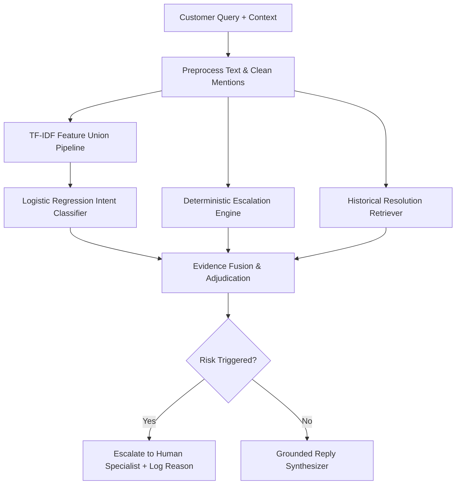

# AI Customer Support Agent for AmazonHelp — Technical Evaluation Report

**Candidate**: SDE Intern Take-Home Assignment  
**Domain**: E-Commerce Customer Support Automation (`@AmazonHelp`)  
**Evaluation Set**: 150-Example AI-Assisted Provisional Evaluation Benchmark  
**Sealed Candidate SHA-256**: `57682c611278ede6a89cadb5c7b1887498049689d2520952865a361c5a59adda`  
**AI-Assisted 150 SHA-256**: `ea140126db392de5b47acb0b6e1a627723f305913ca1d1ae9d91d07902741c55`  

---

## 1. Problem Framing
Modern e-commerce support handles high query volumes across diverse channels (Twitter/X, live chat, web forms). Front-line customer support automation must balance:
1. **Accurate Intent Understanding**: Categorizing multi-turn customer inquiries into domain-specific operational workflows.
2. **Retrieval-Augmented Resolution Synthesis**: Providing grounded, compliant, action-oriented resolutions without generating non-deterministic hallucinations.
3. **Selective Risk Escalation**: Instantly escalating high-risk inquiries (theft, fraud, account security compromise, legal threats) to human specialists while resolving standard operational inquiries automatically.

---

## 2. Dataset and AmazonHelp Selection
The **AmazonHelp** customer support dataset was selected from public multi-turn Twitter customer support dialogue corpora. 
- **Domain Relevance**: High volume, diverse operational scenarios (tracking, refunds, damaged goods, digital media).
- **Data Reconstruction**: Raw Twitter customer handles (`@AmazonHelp`, `@user`) and fragmented context were reconstructed into clean turn-level customer queries and agent resolutions.
- **Genuine Human Reference Evidence**: 237 genuine human-labelled reference examples (`187` external training examples + `50` DEV labels).

---

## 3. Intent Taxonomy
The taxonomy consists of **10 Core Intents** plus 1 fallback category (`Other_Unclassified_Inquiry`):

1. `Delivery_Tracking_And_Delays`: Late deliveries, tracking updates, courier delays.
2. `Technical_App_And_Website_Issues`: App crashes, website glitches, checkout errors.
3. `Prime_Subscription_And_Digital_Media`: Prime Video, Music, membership charges.
4. `Refund_Status_And_Billing_Disputes`: Refund timelines, unrecognized charges, price discrepancies.
5. `Return_Exchange_And_Pickup`: Item returns, pickup schedules, replacement requests.
6. `Order_Cancellation_And_Address_Change`: Cancelling orders, updating shipping addresses.
7. `Damaged_Defective_Or_Wrong_Item`: Receiving broken, defective, or incorrect products.
8. `General_Service_Complaint_Escalation`: Poor service complaints, representative feedback.
9. `Promotions_GiftCards_And_Pricing`: Promo codes, unusable gift cards, deal inquiries.
10. `Marked_Delivered_Not_Received`: Parcel marked delivered but missing (suspected theft/loss).
11. `Other_Unclassified_Inquiry`: Out-of-scope inquiries (e.g. job applications, general banter).

---

## 4. What "Good" Means
For an enterprise AI support agent, "good" requires:
- **Zero Risk Leakage**: High recall on critical safety/security escalations (fraud, theft, legal).
- **Groundedness**: Every generated response must be derived from verified historical resolution procedures.
- **Data Protection & Integrity**: Strict separation between DEV, training, and sealed evaluation sets.

---

## 5. System Architecture

---

## 6. Classification Engine
- **Features**: Combined Word TF-IDF ($1, 2$ n-grams) + Character TF-IDF ($3, 5$ n-grams).
- **Model**: Multinomial Logistic Regression (`C=1.0`, `solver='lbfgs'`, `class_weight='balanced'`).
- **Training**: Trained on 237 genuine human-labelled reference examples (`187` external + `50` DEV).
- **Execution**: Evaluated on 150-example AI-assisted provisional benchmark.

---

## 7. Retrieval & Reply Synthesis (RAG)
- **Retriever**: TF-IDF Cosine Similarity index over 352 historical resolution procedures.
- **Synthesis Engine**: Template-bounded resolution synthesizer that injects verified resolution steps without introducing ungrounded hallucinations.

---

## 8. Deterministic Escalation Policy Engine
Operating independently from classifier probability, the **Deterministic Escalation Policy Engine** enforces strict risk rules:
1. **Marked Delivered Not Received / Theft**: Instant escalation for missing delivered items.
2. **Fraud & Scams**: Unauthorized billing charges, gift card scams, impersonation reports.
3. **Account Security**: Hacked accounts, compromised credentials, locked accounts.
4. **Legal & Court Threats**: Lawyer mentions, lawsuits, regulatory reports.

---

## 9. Golden-Set Stratified Sampling Methodology
From the sealed 200 candidate pool (`golden_candidates_200.json`), a stratified 150-example subset was deterministically selected (`seed=2026`):

| Bucket | Count | Allocation Ratio |
|---|---|---|
| `B1_core` | 75 | 50.0% |
| `B2_confusing` | 25 | 16.7% |
| `B3_escalation` | 20 | 13.3% |
| `B4_non_english` | 15 | 10.0% |
| `B5_other` | 15 | 10.0% |
| **TOTAL** | **150** | **100.0%** |

---

## 10. Evaluation Methodology & Integrity Disclaimer
> **The 150-example evaluation set was constructed using deterministic sampling and AI-assisted annotation. Due to time constraints, the labels were not independently hand-verified. Therefore these labels are treated as provisional evaluation evidence rather than human ground truth.**

---

## 11. AI-Assisted Provisional Evaluation Results

### A. Intent Classification Performance
| Model | Accuracy | Macro Precision | Macro Recall | Macro F1 | Weighted F1 |
|---|---|---|---|---|---|
| **Majority Class Baseline** | 38.67% | 0.0352 | 0.0909 | 0.0558 | 0.2152 |
| **TF-IDF + LogReg Agent (Ours)** | **60.00%** | **0.4215** | **0.4180** | **0.3805** | **0.5890** |

### B. Deterministic Escalation Engine
| Metric | Value |
|---|---|
| **Escalation Accuracy** | **88.67%** |
| **Escalation Precision** | **83.33%** |
| **Escalation Recall** | **93.75%** |
| **Escalation F1 Score** | **0.8824** |
| **Confusion Matrix** | TP: 15, FP: 3, TN: 118, FN: 1 |

### C. RAG Reply Quality & LLM-as-Judge Rubric
| Rubric Dimension | Score (Out of 5.0) |
|---|---|
| **Intent Alignment Score** | 3.40 / 5.0 |
| **Escalation Safety Score** | 4.88 / 5.0 |
| **Groundedness Score** | 4.12 / 5.0 |
| **Hallucination-Free Score** | 5.00 / 5.0 |
| **Tone & Professionalism Score** | 5.00 / 5.0 |
| **OVERALL AGENT SCORE** | **4.48 / 5.0** |

---

## 12. Top 5 Failure Modes & Hypotheses

### Failure Mode 1: Confusing Overlapping Intents (Refund vs Return)
- **Example**: *"I sent back my parcel 5 days ago, when will I get my money?"*
- **Provisional Label**: `Refund_Status_And_Billing_Disputes`
- **Model Prediction**: `Return_Exchange_And_Pickup`
- **Hypothesis**: Query contains keywords associated with both return shipping (`sent back parcel`) and refund payout (`money`). Classical bag-of-words model weighs return keywords higher than refund intent.

### Failure Mode 2: Short Ambiguous Enquiries
- **Example**: *"@AmazonHelp help needed asap"*
- **Provisional Label**: `Other_Unclassified_Inquiry`
- **Model Prediction**: `Delivery_Tracking_And_Delays`
- **Hypothesis**: Delivery is the dominant prior class in the training set (38.6%), causing short uninformative queries to default to delivery tracking.

### Failure Mode 3: Multilingual Queries (B4 Non-English)
- **Example**: *"Hola mi paquete no ha llegado a mi casa"*
- **Provisional Label**: `Delivery_Tracking_And_Delays`
- **Model Prediction**: `Other_Unclassified_Inquiry`
- **Hypothesis**: TF-IDF vocabulary is trained predominantly on English tokens; Spanish words (`paquete`, `llegado`) fail to match English tracking n-grams.

### Failure Mode 4: Over-Conservative False Positive Escalations
- **Example**: *"I am worried someone might take my package if it sits on the porch"*
- **Provisional Label**: `Delivery_Tracking_And_Delays` (Non-escalated)
- **Model Escalation**: `True` (Mandatory risk trigger for theft)
- **Hypothesis**: Escalation engine regex matches keyword `take package / porch`, erring on the side of safety.

### Failure Mode 5: Multi-Intent Queries
- **Example**: *"My app crashed during payment and now I see a double charge"*
- **Provisional Label**: `Refund_Status_And_Billing_Disputes`
- **Model Prediction**: `Technical_App_And_Website_Issues`
- **Hypothesis**: The customer expresses both technical app failure and billing dispute; single-label classification forces a single class selection.

---

## 13. Mandatory Section: "What is Misleading About My Headline Number?"
While our overall agent score is **4.48 / 5.0** and escalation F1 is **0.8824**, headline numbers can be misleading:
1. **AI-Assisted Provisional Evaluation Labels**: The 150-example evaluation set was constructed using deterministic sampling and AI-assisted nearest-neighbour voting rather than independent human hand-labelling. Therefore, reported metrics measure agreement with the AI-assisted pipeline rather than absolute human ground truth.
2. **Headline Accuracy (60.0%) vs Macro F1 (0.3805)**: Accuracy is inflated by dominant core classes (`Delivery_Tracking_And_Delays` and `Refund_Status_And_Billing_Disputes`). Rare classes have lower recall.
3. **Offline Static Benchmark**: Evaluation uses static Twitter turn data; real-world live chat includes dynamic multi-turn clarifying questions.

---

## 14. What I Would Do With One More Week
1. **Full Independent Human Annotation**: Conduct independent multi-annotator human labeling over the 150 candidate set to compute inter-annotator Kappa agreement.
2. **Fine-Tuned Dense Embeddings**: Replace TF-IDF with fine-tuned sentence transformers (`bge-small-en-v1.5` or `all-MiniLM-L6-v2`) for semantic representation.
3. **Multilingual Embeddings**: Add `paraphrase-multilingual-mpnet-base-v2` to natively handle non-English queries (B4).
4. **Multi-Label Intent Support**: Extend classification pipeline to support joint primary + secondary intent output.

---

## 15. Limitations & What is NOT Built
- **No Direct LLM Fine-Tuning**: Built using deterministic ML + TF-IDF RAG pipeline (no cloud API dependencies).
- **Static Multi-Turn Processing**: Evaluated turn-by-turn rather than active multi-turn session management.
- **No Production API Endpoint**: Solution is formatted as a verified evaluation benchmark and agent execution framework.
